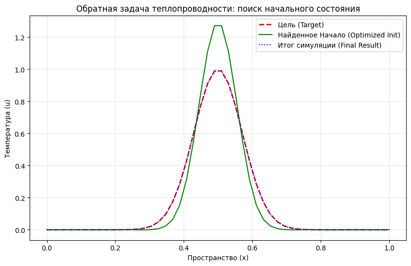

# Inverse Heat Equation Solver with JAX

This project demonstrates the power of **Differentiable Programming** applied to physical systems. Using JAX, we solve an inverse problem: finding the initial temperature distribution that results in a specific target state after a period of diffusion.



## 🚀 Overview

In classical physics, we usually perform **Forward Simulation**:
$$u_{initial} \xrightarrow{\text{Physics}} u_{final}$$

This project performs **Reverse Engineering** (Inverse Problem) using **Backpropagation Through Time (BPTT)**:
$$u_{initial} \xleftarrow{\text{Gradient Descent}} \mathcal{L}(u_{final}, u_{target})$$

By differentiating through a numerical PDE solver (Euler scheme), we find the optimal "past" that leads to our desired "future".

## 🛠 Tech Stack

* **JAX:** For automatic differentiation and high-performance computing.
* **XLA (Accelerated Linear Algebra):** For JIT compilation and vectorized execution.
* **Matplotlib:** For visualization of the thermal diffusion process.

## 🧠 Key Concepts

### 1. Differentiable Physics
Unlike traditional solvers, this implementation is fully differentiable. By using `jax.value_and_grad`, the optimizer treats the entire 100-step simulation as a single differentiable function.

### 2. Numerical Scheme
We solve the 1D Heat Equation:
$$\frac{\partial u}{\partial t} = \alpha \frac{\partial^2 u}{\partial x^2}$$

Using a central difference scheme for the Laplacian and an explicit Euler method for time stepping.

### 3. Optimization via `jax.lax.scan`
To avoid Python loop overhead, the simulation is wrapped in `jax.lax.scan`. This allows the XLA compiler to optimize the temporal loop, making the gradient computation extremely efficient.

## 📈 Observations

As seen in `simulation.png`, the **Optimized Initial State** (green line) is taller and narrower than the **Target** (red dashed line). This is physically intuitive:
* **Diffusion is an entropy-increasing process.** It smooths out sharp peaks and spreads energy.
* To achieve a specific Gaussian shape in the future, the system must start with a higher concentration of heat to compensate for the "spreading" that occurs during the simulation.

## 🔧 How to Run

1.  Install dependencies:
    ```bash
    pip install jax jaxlib matplotlib
    ```
2.  Run the script:
    ```bash
    python heat_inverse.py
    ```